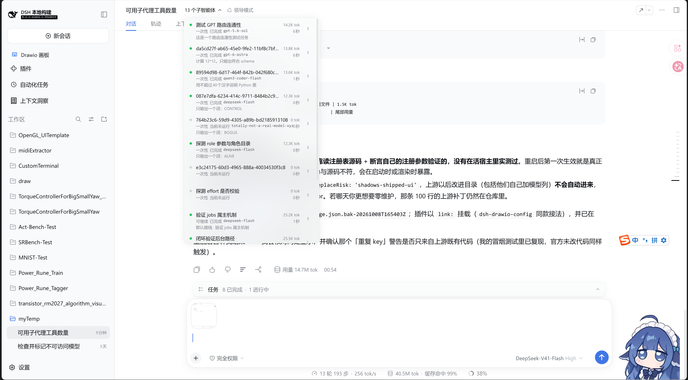
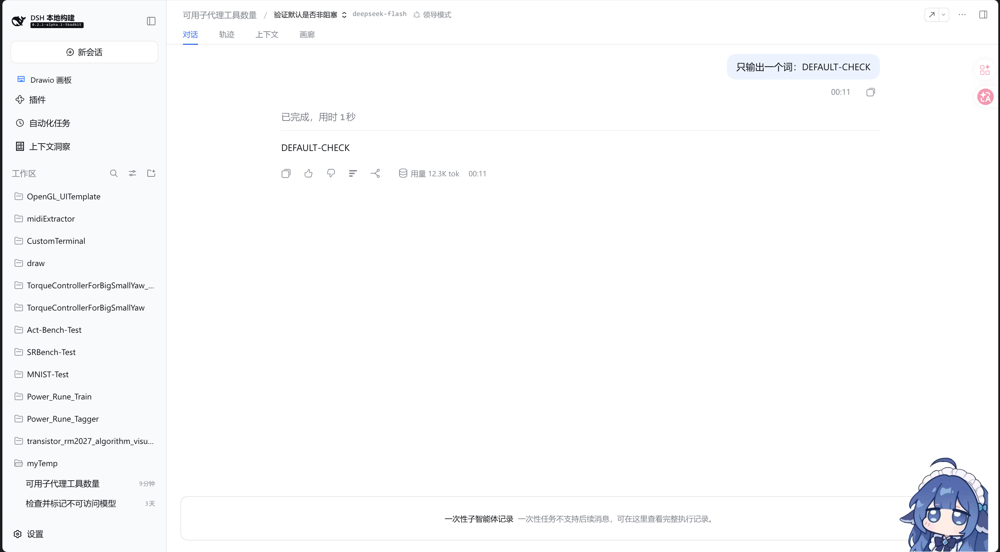

# dsh-plugin-subagent-model-route

Annotate every subagent with the **model route it actually ran on**, in both places you look
at a subagent: the parent's catalog list and the child session's own header.



*The parent's catalog: thirteen subagents, each row stacking the name, a `mode · activity ·
route` badge line, and the durable title below it. The routes shown (`gpt-5.6-sol`,
`gpt-6-astra`, `qwen3-coder-flash`, `deepseek-flash`) are the ones those delegations actually
ran on.*



*Opening a child session: the route (`deepseek-flash`) sits beside the lineage breadcrumb, in
the header, above the read-only one-shot composer notice.*

## Effect

Two surfaces change, and nothing else:

| surface | before | after |
| --- | --- | --- |
| Parent catalog row | `name`, then `title · one-shot · running` on one line | three lines: `name` / `one-shot` `running` `gpt-5.6-sol` / `title` |
| Child session header | breadcrumb switcher only | breadcrumb switcher + the route |

A row whose child never issued a request shows **no** badge. Hovering a badge gives the full
`provider/model · reasoningEffort`, and the row's accessible name carries the route too.

## Effect, expressed as consequences

Worth reading before installing. This plugin deliberately **shadows shipped UI**, and that has
a price:

1. **Rows get taller.** 44px → 59px, so the dropdown, capped at
   `min(560px, 100vh - 140px)`, now shows roughly 9 rows instead of 12 before it scrolls.
2. **You fork that region of the shipped UI.** The catalog contract marks this seat
   `replaceRisk: 'shadows-shipped-ui'`. Upstream improvements to those two occupants —
   including DeepSeek adding a model column themselves — **will not reach you**; you have to
   re-vendor and re-apply the two modifications (see [PATCH-RECORD.md](./PATCH-RECORD.md)).
3. **A shipped-UI bug in that region becomes yours.** The renderer is a verbatim copy of the
   shipped one (the copy even reproduces upstream's React duplicate-key warning about the child
   session id).
4. **The stylesheet is injected twice.** The vendored CSS module is a second copy of the
   shipped sheet, so the page carries both. It is small, and the hashed class names differ
   (different file content), so nothing collides.
5. **The shipped occupants are shadowed, not unregistered.** They stay registered and render
   nothing — a small, inert cost.
6. **It duplicates the `subagent-director` dock if you run both.** That plugin draws the route
   under the composer for an opened child; this one draws it in the header. Expect the route
   twice in the same view until you drop one of them.
7. **The route is the *last request's* route.** A child that switched models mid-life shows only
   the most recent one, and "no badge" means "never issued a request", not "unknown".
8. **Only those two surfaces change.** The read-only composer, the Sidebar chat tab, and the `@`
   reference source stay shipped.
9. **Uninstalling reverts everything.** Nothing is persisted and no host-side surface changes;
   remove the package from the profile's `bundles` and restart.
10. **Activation needs a host restart.** `dsh.client` is composition-level config and does not
    hot-reload.

## Why this is a plugin that shadows the shipped UI

The shipped `@deepseek-ai/dsh-client-ui-subagent` decides what those two surfaces render, and
it cannot be extended additively: `conversation.session.header.lineage` is a `single` cell with
no `registerOptions` and no declared children, and there is no per-row slot at all. Taking the
seats over is the only way to add the route from outside.

The slot registry throws when a second registration lands on an occupied cell at the *same*
priority and shadows on any *different* one, so this plugin registers both seats at
`priority: -1` (the shipped occupants own the default `0`):

| seat | shipped occupant | how this plugin takes it |
| --- | --- | --- |
| `conversation.session.header.lineage` (`single`) | `SubagentHeaderLineage` | shadow at priority `-1` |
| `conversation.session.header.actions` (`list`) | `SubagentCatalogAction` (id `subagent-catalog`) | re-register the **same id** at priority `-1` |

The route itself comes from the durable `modelSelection` projection (recorded on every
`request/header`), read through the same `summary.projectionValues` the row already uses for
token usage and timing — so this adds **no RPC, no host change, no projection, no new slot**.

## Mounting

Mount it as a profile bundle, exactly like any other local plugin:

```jsonc
// ~/.dsh/profiles/web/package.json
"dependencies": {
  "dsh-plugin-subagent-model-route": "link:/path/to/dsh-plugin-subagent-model-route"
},
"dsh": { "profile": { "bundles": [
  // ...after @deepseek-ai/dsh-base and @deepseek-ai/dsh-web-app
  "dsh-plugin-subagent-model-route"
] } }
```

Or install it the supported way, which edits both lists for you:

```sh
dsh plugin --profile web add dsh-plugin-subagent-model-route     # from npm
dsh plugin --profile web add ./dsh-plugin-subagent-model-route   # from a checkout
```

Then **restart** the host.

## Development

`node_modules/` in this checkout is a dev-only shim of symlinks into a harness checkout (the
host's own `react`/`react-dom`/`@deepseek-ai/*`, plus the monorepo's tooling), because the
`@deepseek-ai/*` packages are only published to npm as a `0.0.1-rc.1` placeholder. A normal
`npm install` against the versions listed in `devDependencies` replaces it.

```bash
npm run check      # typecheck -> build -> headless smoke (15 checks)
npm run build      # tsdown: lib/index.js (host half) + lib/client/index.js (closure factory)
npm run watch
npm run smoke      # renders both seized seats under jsdom
```

The out-of-tree build in [`tsdown.config.ts`](./tsdown.config.ts) restates the two contracts the
monorepo's own `clientBundle()` preset enforces — the
`window.__ModuleLoader__.load({ id, factory })` handoff, and the lightningcss pass that turns
`*.module.css` into a hashed class map plus a tagged `<style>` injection — because that preset
locates packages by globbing the monorepo and cannot build a package outside it. The build needs
**only `tsdown` + `lightningcss`**: the host-provided packages stay external and are never
resolved, which is what keeps a git install from failing on unpublished `@deepseek-ai/*`
versions.

`scripts/smoke.mjs` runs the real artifact through the real handoff and asserts, among other
things, that the bundle's `require` set is exactly the four platform seed rows (`react`,
`react/jsx-runtime`, `react-dom`, `@deepseek-ai/dsh-client-ui-primitives`) — a request the host's
module table cannot answer would be a guaranteed runtime throw.

## Publishing

See [PUBLISHING.md](./PUBLISHING.md) for the full checklist, the DSH-specific traps, and the
catalog-submission steps. The short version: fill in the `CHANGE-ME` repository fields, publish to
npm with `lib/` built at publish time, verify in a clean profile, tag the repo with the
`dsh-plugin` topic, then submit to the community catalogs.

## Maintenance

The vendored renderer is pinned to the shipped one at `deepseek-ai/deepseek-harness`
`master @ 5badb15009`. When upstream changes `SubagentHeaderLineage.tsx` or its stylesheet,
re-vendor and re-apply the two modifications from [PATCH-RECORD.md](./PATCH-RECORD.md) — or, on a
machine that owns the harness checkout, prefer the equivalent upstream patch
([UPSTREAM-PATCH.patch](./UPSTREAM-PATCH.patch)), which needs no shadowing at all.

## License

MIT — see [LICENSE](./LICENSE). The vendored renderer originates from the MIT-licensed
`@deepseek-ai/dsh-client-ui-subagent`.
